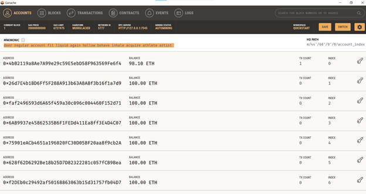

# Homework-19-Blockchain-Python

For this homework, I developed a code to pay professionals using Etherium. See below screenshots for the Streamlit application used to calculate the employee's wages and the Ganache showing the balance of the crypto wallet. 

